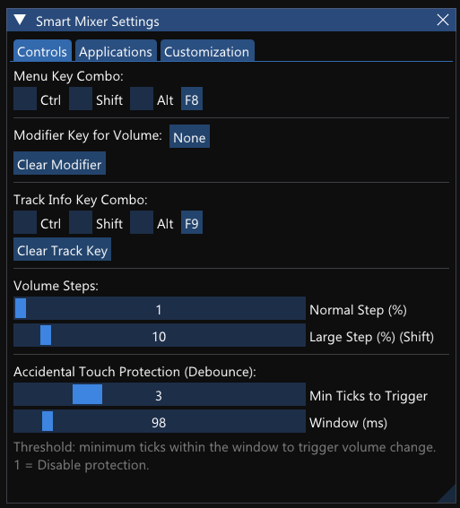
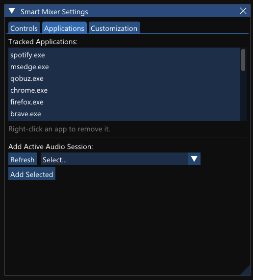
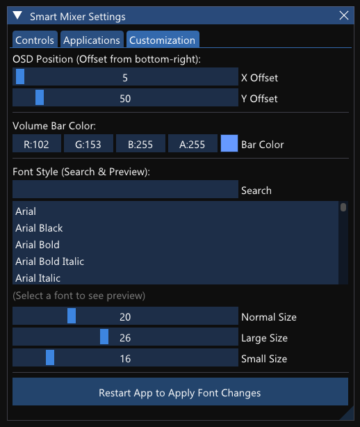

# XPG Summoner Media Volume (Smart Volume Mixer)

A lightweight C++ utility for Windows designed to fix buggy, overly-sensitive volume scroll wheels (specifically tailored for the **XPG Summoner** keyboard) and provide a customizable, sleek On-Screen Display (OSD) overlay.

Built with C++20, DirectX 11, and Dear ImGui.

---

## Screenshots

### On-Screen Display (OSD) Overlay


### Main Configuration Menu


### Track Info Display


---

## Features

- **Volume Roller Debouncing**: Solves the issue where physical volume wheels send chaotic, rapid volume-up/down events. Custom threshold and time windows filter out spikes.
- **Custom OSD Overlay**: Sleek, modern, hardware-accelerated OSD built with DirectX 11 that shows up when the volume changes.
- **Application-Specific Controls**: Configurable to adjust volume only for specific media applications or the system master volume.
- **Interactive Menu**: Toggle on-screen settings menu with a hotkey (default: `F8`) to customize:
  - Volume scroll step sizes (normal and large/shift steps).
  - Debounce timings and tick threshold parameters.
  - Overlay positioning (offsets).
  - Font styling (Normal/Large/Small font sizes, system font family support).
  - Colors (custom color picker for the volume bar).
- **Track Info Display**: Request active track information (default: `F9`) using Windows Media APIs.
- **Crash Auto-Restart**: Runs robustly in the background, auto-restarting itself if any unhandled crash occurs.

---

## How It Works

1. **Low-level Keyboard Hook**: Intercepts `VK_VOLUME_UP`, `VK_VOLUME_DOWN`, and `VK_VOLUME_MUTE` key messages at the OS level.
2. **Debounce Logic**: Groups consecutive volume ticks within a microsecond window (e.g., 200ms) and filters out noise based on the configured threshold.
3. **WASAPI Audio Engine**: Interfaces with Windows Core Audio APIs (`IAudioEndpointVolume`, `ISimpleAudioVolume`) to adjust system and application volumes smoothly.
4. **DirectX 11 ImGui Overlay**: Renders a click-through, transparent overlay window.

---

## Building from Source

### Prerequisites

- Windows 10 / 11
- Visual Studio 2022 (with "Desktop development with C++" workload) or CMake 3.20+
- Git

### Build Instructions

1. Clone the repository:
   ```bash
   git clone https://github.com/Vadson159/XPG-Summoner-MediaVolume.git
   cd XPG-Summoner-MediaVolume
   ```

2. Generate project files and build with CMake:
   ```bash
   mkdir build
   cd build
   cmake ..
   cmake --build . --config Release
   ```

The compiled executable `SmartVolumeMixer.exe` will be located in the `build/Release/` directory.

---

## Configuration

Settings are saved in `config.json` inside the application folder. The default shortcuts are:
- **`F8`**: Open configuration menu.
- **`F9`**: Display current track info.

---

## License

This project is licensed under the MIT License.
